# Part 2. NEWACE Metaverse by NFT

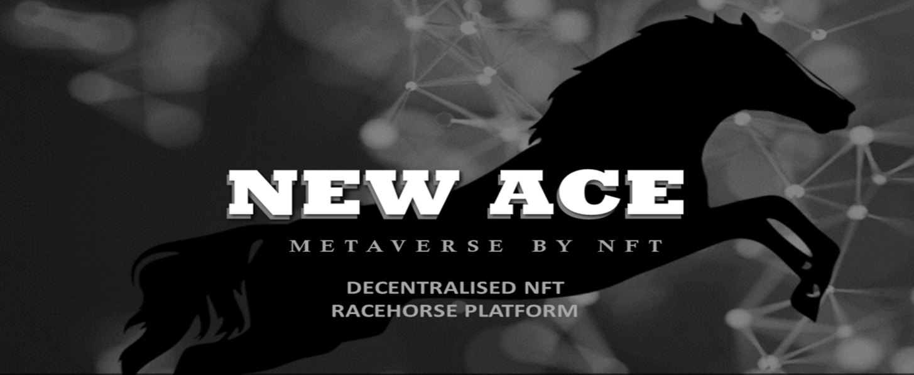

## **1. Overview**

**NEWACE** foundation has been developing horse racing games for more than 10 years, and the game has been certified as an international casino.

Based on this, accessibility will be expanded using the current WEB3.0 protocol and the transparency of blockchain technology will be further maximized.

The foundation will create a P2E-based blockchain world that not only ordinary fans who like horse racing, but also crypto game users can easily participate in and enjoy.

**Optimization**

Minimize 3D resources, create no-delay environment.

**Accessibility-WEB3.0**

Web3.0 protocol environment is easy to access for all devices and is optimized for P2E-based games.

**Collection**

Stimulating factors in collecting, maintaining asset value, and building collection algorithms.

The development point keywords are “Accessibility”, “Optimization”, and “Collection”, and are creating games that can be accessed anywhere in an optimized environment and stimulate collection desire.

## **2. World view**

**NEWACE** team reflected the realistic part of horse racing as much as possible through the data and know-how of more than 10 years of development and service.

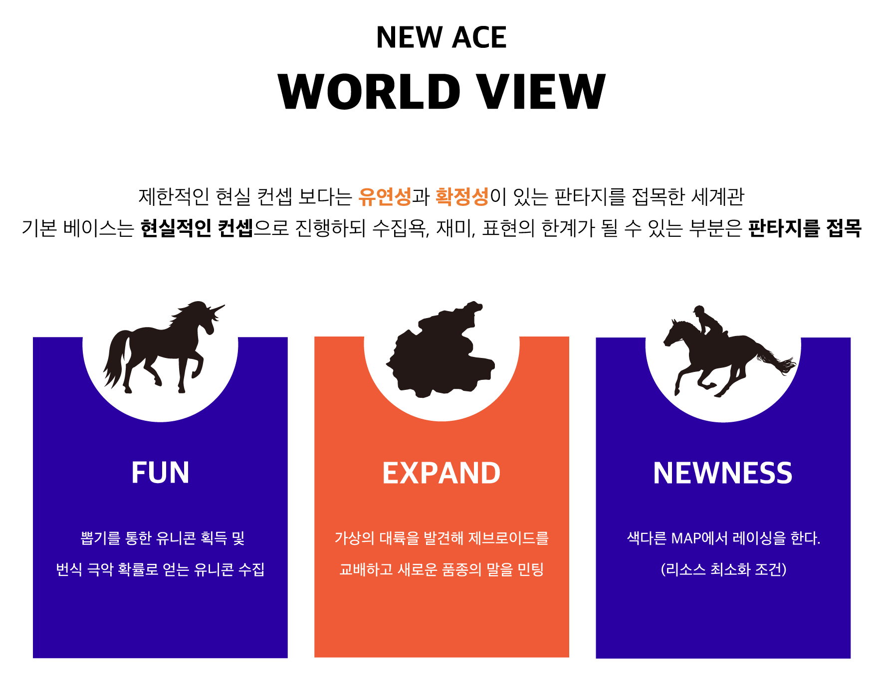

A world view incorporating a fantasy of flexibility and expansion, not a limited reality concept.

The basis proceeds with a **realistic concept**, and **fantasy is applied** to areas that have limitations in collection, fun, and expression.

FUN

Acquisition of unicorns by drawing and collection of unicorns with a sparse probability of breeding.

EXPAND

Discovering a virtual continent, breeding zebroids and minting a new breed of horse.

NEWNESS

Racing under different MAP. (Resource minimization conditions)

The new **NEWACE** Metaverse combines technologies such as WEB3.0 and blockchain with the past version to create and continue to expand the worldview involving many users through **NEWACE**’s own adventure by reflecting existing strong realistic parts and fantasy elements.

## **3. NEWACE Platform**

**The NEWACE** project developed not only races but also real estate NFT for farmers, as well as RPG elements that can improve horses statistics by breeding and training horses as farm owners.

Therefore, various economic activities are available through three factors: racing, real estate, and horse, and you can achieve better results according to your efforts in NEWACE’s adventure space.

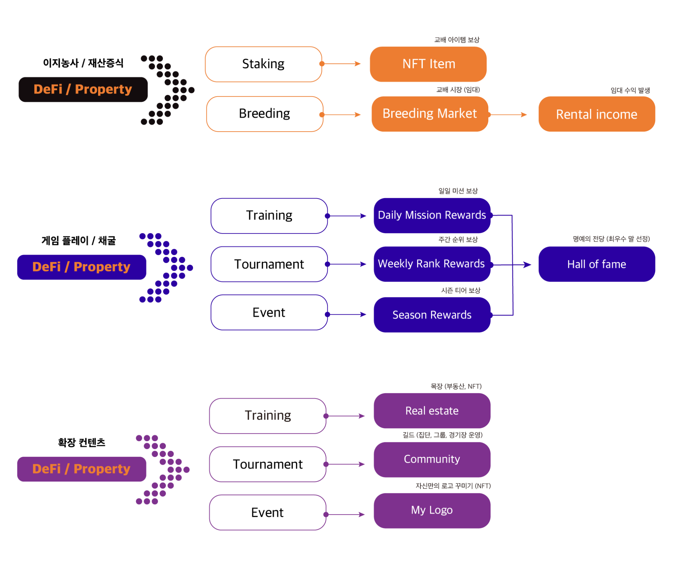

이지농사/재산증식 Easy farm/Property increase

교배 아이템 보상 Breeding item rewards

교배 시장 (임대) Breeding market (rental)

임대 수익 발생 Generate rental income

게임 플레이/채굴 Game play/Mining

확장 컨텐츠 Content expansion

확장 (부동산, NFT) Expansion (Real estate, NFT)

길드…. Guild (Manage community, group and arena)

로고… Create my own logo (NFT)

**3-1. Genetic algorithm**

The genetic algorithm of horses in the game is applied in a similar structure to the actual genetic algorithm.

Genetic algorithms are applied to all elements that are organized and classified, including the visual elements of horses.

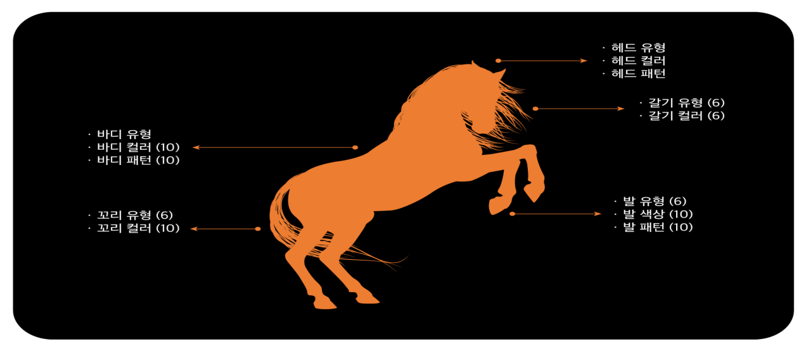

헤드 유형 Head type

헤드 컬러 Head color

헤드 패턴 Head pattern

갈기 유형 Mane type

갈기 컬러 Mane color

발 유형 Hooves type

발 색상 Hooves color

발 패턴 Hooves pattern

바디 유형 Body type

바디 컬러 Body color

바디 패턴 Body pattern

꼬리 유형 Tail type

꼬리 컬러 Tail color

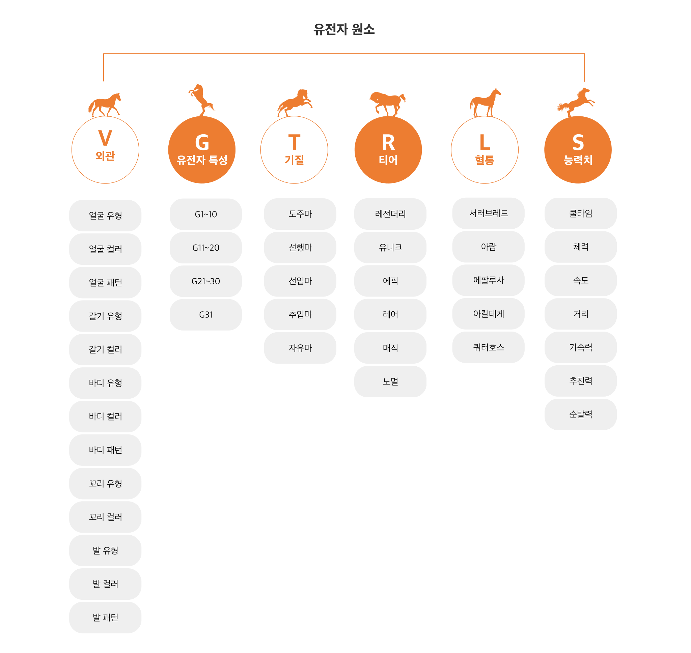

유전자 원소 Gene Element

외관 Visual

Head type

Head color

Head pattern

Mane type

Mane color

Body type

Body color

Tail type

Tail color

Hooves type

Hooves color

Hooves pattern

유전자 특성 Gene feature

기질 Tendency

Front-runner horse

Extremity horse

Stalker horse

Canadian horse

Free horse

티어(희귀성) Rarity

Legendary

Unique

Epic

Rare

Magic

Normal

혈통 Lineage

서러브레드 Thoroughbred

아랍 Arab

애팔루사 Appaloosa

아칼테케 Akhal Teke

쿼터호스 Quarter horse

능력치 Statistics

쿨타임 Cooltime

체력 Stamina

속도 Speed

거리 Distance

가속력 Accelerating force

추진력 Driving force

순발력 Reaction rate

**3-2. Racecourse**

There are 4 racecourses now and there will be more in the future.

Each racecourse has different entry levels and courses to have diverse race results.

There are designated and random racecourses in the game so that the game will be more fun.

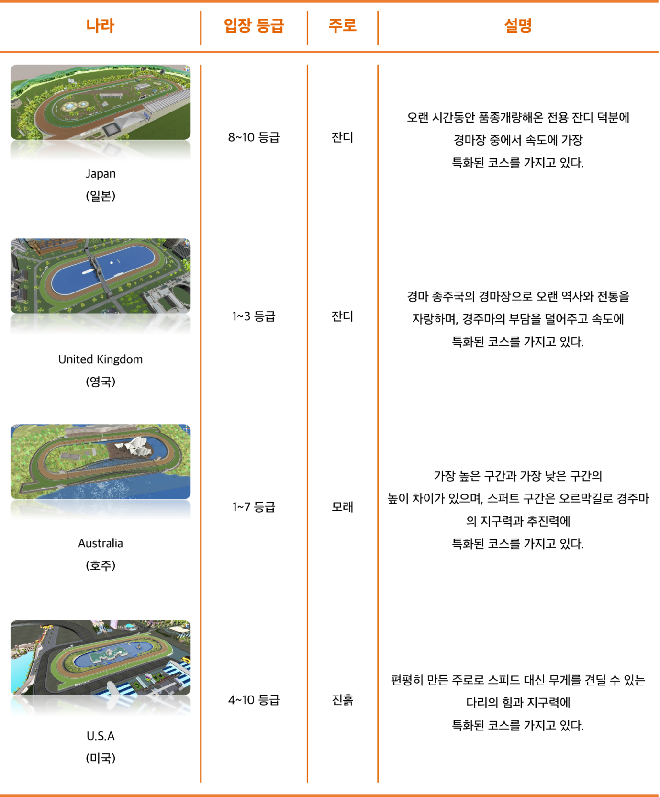

나라 Country

입장 등급 Entry level

주로 Course

잔디 Turf

모래 Sand

진흙 Mud

설명 Description

It is the most speed-specific course among racecourses due to its long-term variety of improvement.

It is the birthplace of horse racing with a long history and tradition, and it has a speed-specific course that relieves the burden of racehorses.

It has a height difference between the highest section and the lowest section, and the spurt section is an uphill road and has a course specialized for the endurance and propulsion of racehorses.

It has a flat course specialized for leg strength and endurance that can withstand weight instead of speed.

**3-3. Racing**

NFT items and horses that have grown up in horse development games can compete in 1:1 individual races or a several users can race together.

Horse owners can prove the value of their horses through horse development games, and users will increase the fun of the game through individual betting.

* **Race element**

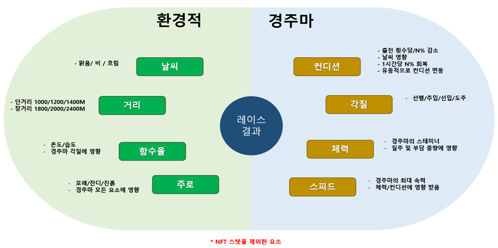

**환경적 Environment**

Weather - Sunny/Rainy/Cloudy

Distance - Short distance/ Long distance

Percentage of moisture content - Temperature/Humidity

Affect to the strategy of racehorses

Course - Sand/Turf/Mud

Affect to all elements of racehorses

**경주마 Racehorse**

Condition - Reduce /N% per game

\- Weather effect

\- Recover N% per hour

\- Fluctuating conditions

Strategy - Canadian horse/Extremity horse/Stalker horse/Front-runner horse

Stamina - Stamina of racehorse

\- Affect to speed and scale weight

Speed - maximum speed of racehorse

\- Affected by stamina/condition

**\*Elements except NFT statistics**

**레이스 결과 Race result**

* **Race**
* Players can select the best horse and participate in various races through competitive elements in the **NEWACE** project.
* Players can get $NEA/ $SUGAR tokens as a reward in a race.
* Own an NFT racehorse to participate in the race.
* It is an asynchronous multiplayer race, and requires a $NEA token as an entrance fee to participate.
* There are differences in cost, rewards, and rules depending on the type of game, and users can play with their own racehorses depending on the situation.
* Of the total entry fee for participating in the race, 80% will be paid as a prize to the top-ranked horse, 8% to the racecourse operator, 5% to the participant’s bonus pool, and 7% to the platform.
* Racing ensures fair competition based on the same group of racehorses based on scoring criteria.
* **Race distance**
* There are three distance types of **NEWACE** racetrack and are applied depending on the level class of the racehorse.
* 1200M
* 2400M
* 3600M
* **Race rule**
* Players can participate in the race by selecting horses according to the class.
* Enroll in the queue by paying a race entrance fee for the class.
* The total number of horses required for the game is 12, and the race begins after N minutes when all the conditions are satisfied.
* \*Exception: If the racehorse is not filled within the specified time, dummy data will be utilized.
* Dummy server data is prepared for each class to match the number of plays in the game time so that the race will continue without an issue. If the dummy wins, it is distributed according to the race rules, or tokens are burned.
* **Race class**
* A racing class is a system designed to compete with horses at similar levels in proportion to their competence. This means preventing victory monopolies.
* The higher the class, the more rewards can be earned.
* Racehorses in the top three of each race will earn 1 point, and can be graded to a higher class with accumulated points.

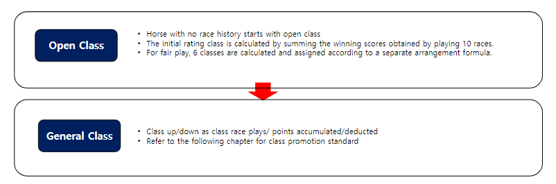

| **Race Participation Condition**                                    | **Race Description**                                                                                                                                                             |
| ------------------------------------------------------------------- | -------------------------------------------------------------------------------------------------------------------------------------------------------------------------------- |
| 
- Horse level

- Condition N% above

- Horse score
 | 
- Class races are divided into grades 1 to 6. Promote according to race winning rate

- Only available for horse class races.

- Pay by points based on ranking
 |

* **Tournament racing (PVP)**

\- There is a race for each class, and $NEA tokens are distributed according to the ranking of 1st to 5th.

\- Participate in the race by paying an entrance fee with a $NEA token.

\- Races are held every day according to each time zone, and you can participate in each class.

\- 80% of the entrance fee is paid as a prize to the top-ranked horse.

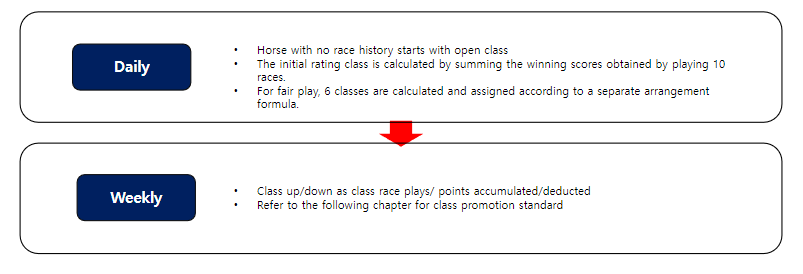

| **Race Participation Condition**                                                   | **Race Description**                                                          |
| ---------------------------------------------------------------------------------- | ----------------------------------------------------------------------------- |
| <ul><li>Participate N times in the preliminary match of the previous day</li></ul> | - Final based on horses participating in the previous day’s preliminary match |
| - Participate N times in preliminary match of the week (Mon\~Fri)                  | 
- Progress condition

- Every Saturday has races based on UTC
     |

* **Season event racing (PVP)**

\- As a game held on the platform, $NEA tokens will be doubled depending on the ranking from first to third.

\- The entrance fee is paid with $NEA tokens, which is set higher than regular PVPs, and rewards are doubled.

\- Users with the highest winning percentage in each season are recorded in the Hall of Fame and can get season rewards.

* **Class ranking level**

|                      | **Rank**           | **Winning points** | **Entrance fee/Rewards** |
| -------------------- | ------------------ | ------------------ | ------------------------ |
| **General Class**    | **Bronze**         | **0\~100**         | **10\~**                 |
| **Silver**           | **101\~200**       | **100\~**          |                          |
| **Gold**             | **201\~300**       | **200\~**          |                          |
| **Platinum**         | **301\~400**       | **300\~**          |                          |
|                      |                    |                    |                          |
| **Diamond**          | **401\~500**       | **400\~**          |                          |
| **Master**           | **501\~600**       | **500\~**          |                          |
| **High Class**       | **Grand Master I** | **600\~**          | **Update**               |
| **Grand Master II**  | **800\~**          | **Update**         |                          |
| **Grand Master III** | **900\~**          | **Update**         |                          |
| **Challenger I**     | **1000\~**         | **Update**         |                          |
| **Challenger II**    | **1500\~**         | **Update**         |                          |
| **Challenger III**   | **2000\~**         | **Update**         |                          |

**3-4. Training**

| **Race Participation Condition** | **Race Description**                                                                                                        |
| -------------------------------- | --------------------------------------------------------------------------------------------------------------------------- |
| - No condition                   | 
- Simulation exercise between the racehorses that one owns

- Play a total of 12 horses in your simulation game
 |

* **Training tournament racing (PVE)**

\- Racehorses without race history cannot participate in tournament/event races and must achieve a minimum number of races in training mode to participate in PVP race.

\- At the end of the minimum required race, the racehorse will be initially rated.

\- Training race is free so you can enjoy the game and you can get $SUGAR tokens as a victory reward.

\- You can participate in more races since the horse consumes less stamina than the tournament event.

\- Participating in a training race will earn XP points, and the level and statistics will increase. Both these levels and statistics will be affected by the race.

\- High daily rewards can be obtained through daily missions for user retention.

**3-5. Breeding System**

**The more horses you breed, the stronger horses you can produce.**

* **Breeding mechanism**

Breeding is one way to make a profit in a game.

The gender of a racehorse consists of a male horse (stallion stud) and a female horse (brood mare).

Breeding between a stallion stud and a brood mare can breed new NFT horses.

To breed the next generation of horses requires a stallion stud, a brood mare, and a certain amount of NEA tokens and SEED tokens in the wallet.

If you only own one horse, you can rent a stallion stud or a brood mare as a partner through an in-game breeding farm.

Racehorses cannot participate in race during breeding.

* **Breeding limitation**

Breeding restrictions are applied to maintain the value of racehorses at a stable price in the ecosystem.

\* \[ Regulation on breeding restrictions ]

Stallion stud (male horse): 3 times a month/ 36 times a year

Brood mare (female horse): once a month/ 12 times a year

* **Gene algorithm (GA)**

The breeding system of **NEWACE** is calculated similarly to a combination of biological genetic algorithms.

The next generation of horses can inherit DNA from both parents.

Through various genetic combinations, it may be bred as a horse superior to its parents or may have genes different from their parents due to mutations.

**Breeding develops based on various GA conditions.**

**Category** **Description**

\
**Gender** Gender is determined by a 50% chance of breeding.

**Breed** N kinds of horses are the standard of each horse’s lineage.

**Rarity** NEWACE rarity is made up of normal, magic, rare, epic, unique and legend units, and legend contains only 1% of it.

**Feature** Genetic features are from G1 to M100, and the smaller the number, the higher the statistics.

**Tendency** It means the personality or type of a horse. There will be various results in the race depending on the tendency of the horse, and you will have the same fun as real horse racing.

**Gene** Gene is genetic features, including recessive gene and dominant gene. The higher the dominant gene level, the higher the probability of inheriting appearance or statistic during breeding.

**Lineage** There are six inherent lineages of NFT horses, and breeding horses of the same lineage increases the likelihood of inheriting genes from inherent lineage.

**Statistic** It is an inherent statistical value that a horse has, and it is not externally exposed. All horses have similar statistics, and do not win unconditionally because of their high rarity. In short, it is determined by RNG technology through racing experience, training, and genetic data.

**Visual** It is inherited by the next generation of horses through smart contracts when breeding in a form similar to a genetic algorithm. New types of NFT horses combined with their parents’ genes can be born, but the low probability of mutation can also result in new visual or statistical value.

**3-6. Project Scalability** 1

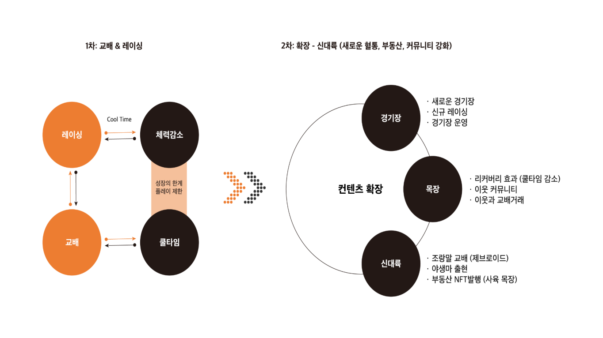

**1st: Breeding & Racing**

Racing

Breeding

Cool time

limit of the growth

Limit of play

Decrease stamina

**2nd: Expansion- New World (New lineage, real estate, strengthening community)**

Content expansion

Racecourse

-New racecourse

-New racing

-Operate racecourse

**Farm**

-Recovery effect (decrease cool time)

-Neighbor community

-Breeding trade with neighbors

**New World**

-Breed pony (zebroid)

-Wild horse emergence

-Real estate NFT issuance (breeding farm)

**Highlighting NFT value through potential and scalability of the project.**

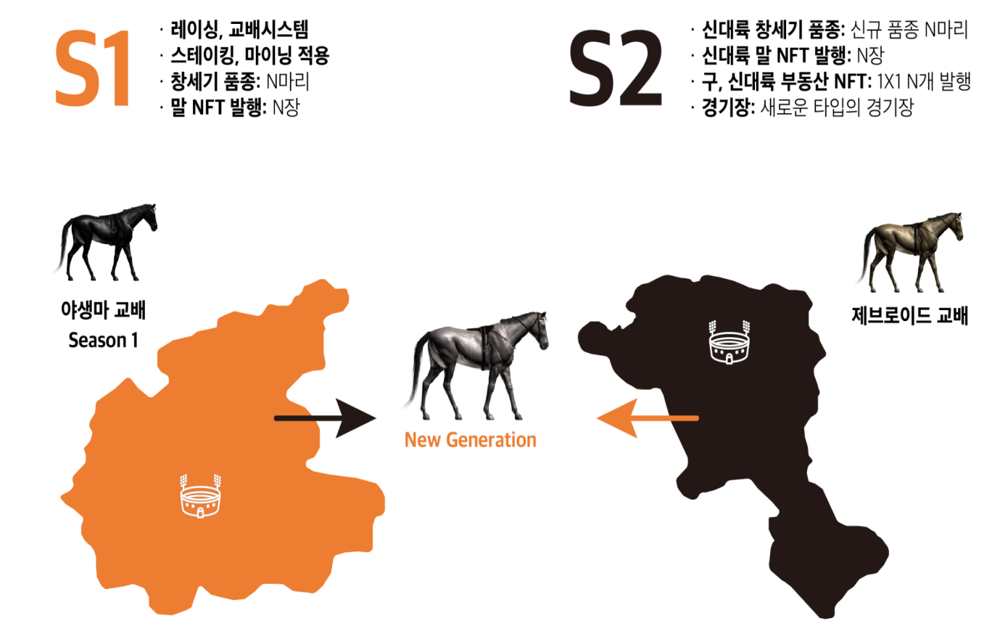

**S1**

Racing, breeding system

Apply staking and mining

Genesis breed: N horses

Horse NFT issuance: N pieces

야생마 교배 Wild horse breeding

**S2**

New World genesis breed: N new breed horses

New World horse NFT issuance: N pieces

Old and New World real estate NFT: Issue 1X1 N pieces

Racecourse: New type of racecourse

제브로이드 교배 Zebroid breeding

## **4. NEWACE NFT**

**4-1. Horse NFT**

**NEWACE** project game items are issued as NFT, and all items from the horse breeding RPG game are applied as NFT. Because NFT is based on blockchain, all information, including properties and sales histories, is stored on blockchain. Therefore, it is impossible for any kind of falsification since the first issuer can be identified at any time.

Applicable items of NFT content within the game include horses, horse-riding association, jockeys, jockey’s clothes, horse trainers, horseshoes, and saddles.

Initial issuance of the items will be from the foundation. Game users can trade with each other based on NEWACE TOKEN later on. In short, users empower all of **NEWACE** PROJECT’s items.

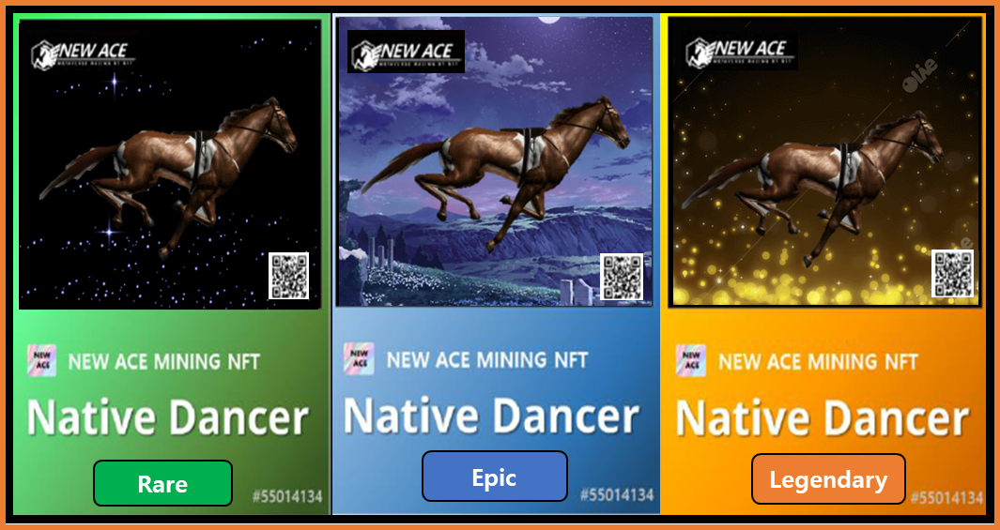

_The images above are for clarity and they can be changed if NFT issues arise._

**NEWACE** is composed of the same type as an actual racehorse and has various features, but its rarity and features are different.

**NFT RARITY**

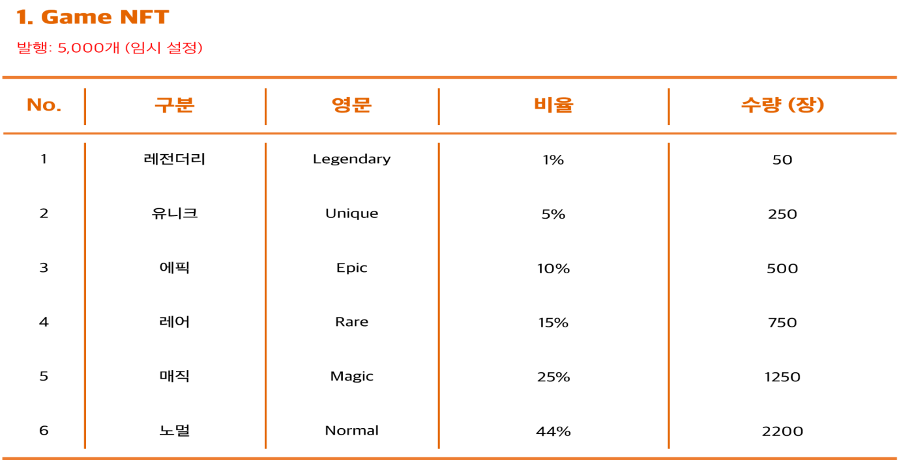

Game NFT

Issuance: 5,000 (temporary)

구분 Section

비율 Percentage

수량(장) Amount (piece)

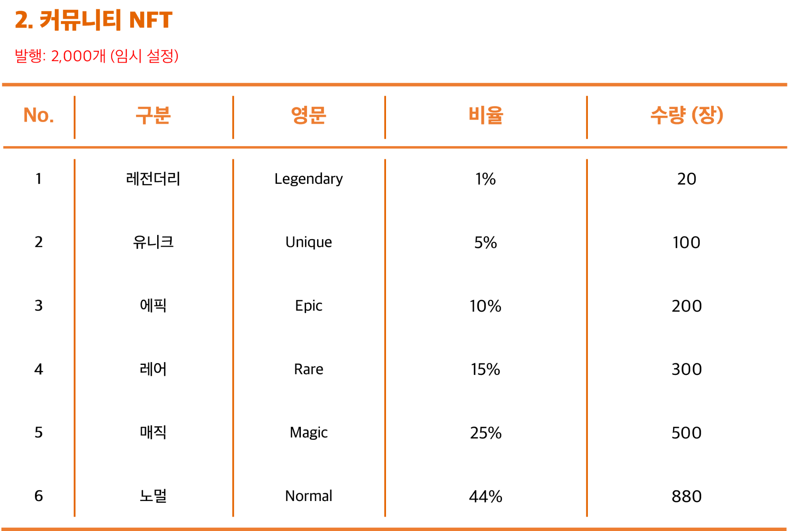

2\. Community NFT

**NEWACE** horses are classified into feature type and common matters

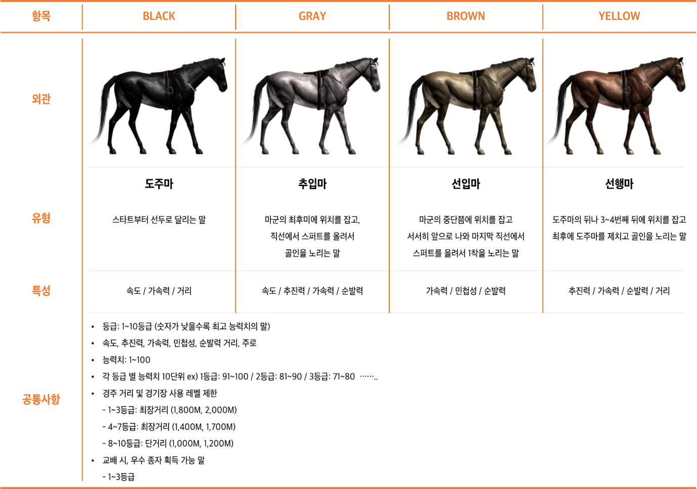

항목 Item

외관 Appearance

유형 Type

특성 Feature

공통사항 Common things

**도주마**

Front-runner horse

Runs from the start to the lead.

Speed / Accelerating force / Distance

**추입마**

Extremity horse

Positions at the end of horses and aims for the goal by raising a spurt in a straight line.

Speed / Driving force / Accelerating force / Reaction rate

**선입마**

Stalker horse

Positions near the middle of horses and slowly comes forward and aims for the first landing by raising a spurt in the last straight line.

Accelerating force / Agility / Reaction rate

**선행마**

Canadian horse

Positions behind front-runner or 3rd to 4th, and finally overtakes Front-runner horse to aim for the goal.

Driving force / Accelerating force / Reaction rate / Distance

**공통사항**

Common matter

Grade: Grade 1-10

Speed, Driving force, Accelerating force, Agility, Reaction rate, Distance, Runway

statistic: 1-100

10 units of statistics for each level. ex) Grade 1: 91-100 / Grade 2: 81-90 / Grade 3: 71-80 ….

Race distance and racecourse level restriction

**Type**

* **Front-runner horse** : Runs from the start to the lead.
  * Feature : Speed, accelerating force, distance
* **Extremity horse** : Positions at the end of horses and aims for the goal by raising a spurt in a straight line.
  * Feature : Speed, driving force, accelerating force, reaction rate
* **Stalker horse** : Positions near middle of horses and slowly comes forward and aims for the first landing by raising a spurt in the last straight line.
  * Feature : Accelerating force, agility, reaction rate
* **Canadian horse** : Positions behind front-runner or 3rd to 4th, and finally overtakes front-runner horse to aim for the goal.
  * Feature : Driving force, accelerating force, reaction rate, distance

**Common matter**

* **Level** : 1 \~ 10 levels (lower number means higher statistic)
* **Speed, driving force, accelerating force, agility, reaction rate, distance, runway**
* **statistic** : 1 \~ 100
* **10 units of statistic for each level**
  * ex) 1 level : 91 \~ 100, 2 level : 81 \~ 90, 3 level : 71 \~ 80
* **Race distance and racecourse level restriction**
  * 1\~3 level: Maximum distance(1,800M, 2,000M)
  * 4\~7 level: Maximum distance(1,400M, 1,700M)
  * 8\~10 level: Short distance(1,000M, 1,200M)
* **Horse capable of obtaining superior seeds in breeding**
  * 1 \~ 3 level

**4-2. Real estates NFT**

Private farms can be owned through real estate NFT, and owning a farm increases the horse’s resilience.

You can enjoy benefits such as increasing certain genes during breeding.

**4-3. Community NFT**

## **5. Token Economy**

**5-1. Token Information**

Token basic information

**Token application**

**NEA – It is a “governance token”, which is the key currency of the platform to be used for purchasing items, trading, staking reward, racing reward, and breeding.**

**SUGAR - It is a “utility token”, which can be obtained within the game. There is no limit to its supply and it aims to encourage P2E activities.**

**SEED - It is a “utility token” mainly for breeding, which can be obtained through staking and mining. There is no limit to its supply, and is used as a game item.**

**Game money (secondary currency)**

**Point – It can be used in the game platform for game money, auxiliary cash as race participation rewards, item purchases, and some parts of the game system.**

**Dual Currency Economy**

**5-2 Tokenomics**

5-3. Business model

**User and Platform revenue structure**

NFT Revenue structure

## **6. Game Roadmap**

**\*\*\* Temporary Roadmap**

**Kick Off**

Starting Game design

Community NFT

**Start Dev**

Develop racing engine

Teaser homepage (Release game system)

**Racing Play**

Develop PVE racing

Develop training mode

Develop horse NFT

**Breeding**

Develop breed system

Release dashboard

**Horse Rental**

Develop rental system

**Tournament**

Develop PVP racing

Develop tournament

**New World**

Develop farm system

(Real estate NFT)
